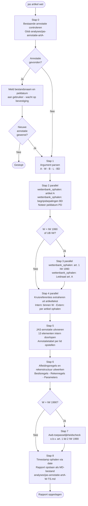

# JAS-workflow — Volledige werkinstructie
## Juridisch Analyseschema v1.0.7 · Belastingdienst, Domein Inning

> **Versie:** 1.0.7 · **Vastgesteld:** 7 oktober 2024  
> **Gebaseerd op:** *Wetsanalyse met het juridisch analyseschema* (MinBZK)  
> **Canonieke URL:** <https://regels.overheid.nl/standaarden/wetsanalyse/v1.0.7>  
> **Commando:** `/jas <artikel> <wet>` — voorbeeld: `/jas art. 25 IW 1990`

---

## Inhoud

1. [Doel en grondslagen](#1-doel-en-grondslagen)
2. [Annotatieworkflow — stap voor stap](#2-annotatieworkflow--stap-voor-stap)
3. [Rapportformat](#3-rapportformat)
4. [JAS-taxonomie en annotatiekaders](#4-jas-taxonomie-en-annotatiekaders)
5. [Kwaliteitseisen](#5-kwaliteitseisen)
6. [BWB-ids en zoekstrategie](#6-bwb-ids-en-zoekstrategie)
7. [Kleurcodering](#7-kleurcodering)
8. [Referenties](#8-referenties)

---

## 1  Doel en grondslagen

Het JAS maakt het mogelijk wetgeving **expliciet en gestructureerd** te annoteren zodat:

- interpretatie- en preciseringskeuzes traceerbaar zijn;
- bij wetswijziging gemakkelijk te bepalen is welke aanpassingen nodig zijn;
- een kennismodel voor ICT-implementatie kan worden opgesteld.

**Centraal principe:** elke conclusie moet terug te voeren zijn op wetgeving of officieel vastgesteld uitvoeringsbeleid.

**Theoretische basis:** Wesley Newcomb Hohfeld (1913/1917) / de Blauwe Kamer (2012).

### Methodologische stappen (JAS)

| Stap | Omschrijving                                                                                     |
|-----:|--------------------------------------------------------------------------------------------------|
|    1 | **Werkgebied bepalen** — scopebepaling: welke wetgeving en welk beleid valt binnen de analyse    |
|    2 | **Structuur zichtbaar maken** — juridische "grammatica" identificeren; formuleringen classificeren|
|    3 | **Betekenis vastleggen** — begrippen definiëren; interpretatie- en preciseringskeuzes expliciteren|
|    4 | **Analyseresultaten valideren** — toetsing met voorbeelden en juridische scenario's              |
|    5 | **Ontbrekend beleid signaleren** — lacunes in uitvoeringsbeleid identificeren                    |
|    6 | **Kennismodel opstellen** — samenhangend model voor ICT-implementatie                            |

---

## 2  Annotatieworkflow — stap voor stap

### Processchema



---

Voer de stappen **strikt in volgorde** uit. Wijk niet af van de voorgeschreven formats.

---

### Stap 0 — Bestaande annotatie controleren

Controleer vóór alle overige stappen of er al een annotatie bestaat:

1. Zoek met `Glob` naar `analyses/jas-annotatie-art[A]-*`  
   (vervang `[A]` met het artikelnummer uit het argument).
2. **Bestaand rapport gevonden?**
   - Lees het rapport via de Read-tool.
   - Meld: *"Bestaande annotatie gevonden: [bestandsnaam]. Wetstekst geldig per [peildatum]. Gebruik je deze als basis of wil je een nieuwe annotatie?"*
   - **Wacht op bevestiging.** Ga alleen verder als de gebruiker een nieuwe annotatie vraagt.
3. **Geen rapport gevonden?** → ga direct door naar Stap 1.

---

### Stap 1 — Argument parsen

Parseer het argument en stel vast:

**Artikelnummer `[A]`** — het nummer na "art." inclusief eventuele letters (9, 25, 36, 2a).  
Als een specifiek lid is vermeld (bijv. "lid 3"), noteer dit als `[L]`; anders geldt `[L]` = het volledige artikel.

**Wet `[W]` en BWB-id `[B]`** — gebruik de onderstaande tabel:

| Afkorting in argument               | Wet `[W]`                              | BWB-id `[B]`   | Begripsbepalingen |
|-------------------------------------|----------------------------------------|----------------|-------------------|
| IW 1990 / IW / Invorderingswet      | Invorderingswet 1990                   | `BWBR0004770`  | Art. 2            |
| Leidraad / LI                       | Leidraad Invordering 2008              | `BWBR0024096`  | Art. 1            |
| UB IW / UBIB                        | Uitvoeringsbesluit IW 1990             | `BWBR0004772`  | Art. 1            |
| AWR                                 | Algemene wet inzake rijksbelastingen   | `BWBR0002320`  | Art. 1            |
| Awb                                 | Algemene wet bestuursrecht             | `BWBR0005537`  | Per hoofdstuk     |

> Geen herkenbare wet: gebruik IW 1990 (`BWBR0004770`) als standaard en vermeld dit in het rapport.

Noteer na afronding van deze stap: `[A]`, `[W]`, `[B]`, `[L]`, en het begripsbepalings-artikel `[BD]`.

---

### Stap 2 — Wetstekst ophalen

**Parallel aanroepen via MCP:**

```
wettenbank_ophalen(bwbId=[B], artikel=[A])    ← te annoteren artikel
wettenbank_ophalen(bwbId=[B], artikel=[BD])   ← begripsbepalingen
```

- De tekst staat direct in het tool-resultaat — geen Bash nodig.
- Noteer de **peildatum `[PD]`** en geldigheidsdatum uit de metadata.
- Noteer de **volledige letterlijke wetstekst** van artikel `[A]` inclusief hoofdstuk/afdeling.
- Extraheer uit `[BD]` alle begripsomschrijvingen die betrekking hebben op termen in artikel `[A]`.

---

### Stap 3 — Art. 1 IW 1990 en Leidraad ophalen *(conditioneel)*

**Alleen uitvoeren als `[W]` = Invorderingswet 1990 of Uitvoeringsbesluit IW 1990.**  
Bij andere wetten: sla Stap 3 volledig over.

**3a — Awb-uitsluitingsclausule:**

```
wettenbank_ophalen(bwbId="BWBR0004770", artikel="1")
```

Sla deze stap over als `[A]` = 1 (tekst al beschikbaar uit Stap 2).  
Noteer de letterlijke tekst van art. 1 lid 2 IW 1990.

**3b — Leidraad Invordering 2008:**

```
wettenbank_ophalen(bwbId="BWBR0024096", artikel=[A])
```

De Leidraad is een beleidsregel, geen wet — verplichte bron voor §8 van het rapport.  
Bij 0 resultaat: noteer dit en gebruik de standaardmelding in §8.

---

### Stap 4 — Kruisreferenties extraheren

Scan de artikeltekst op **expliciete verwijzingen**. Neem uitsluitend verwijzingen op die **letterlijk in de tekst staan** als "artikel X", "artikel X, lid Y", "artikel X, onderdeel Y". Geen verwijzingen toevoegen op basis van eigen kennis.

Maak twee lijsten:

| Lijst    | Inhoud                                                                 |
|----------|------------------------------------------------------------------------|
| Intern   | Verwijzingen naar artikelen binnen dezelfde wet `[W]`                  |
| Extern   | Verwijzingen naar artikelen in andere wetten                           |

Voor **externe** verwijzingen — parallel ophalen:

```
wettenbank_ophalen(bwbId=<id>, artikel=<nr>)   ← één aanroep per extern artikel
```

Dit werkt ook voor Awb-artikelen in hfst. 4–10 die onbereikbaar zijn bij volledige opvraging.

---

### Stap 5 — JAS-annotatie uitvoeren

Voer de annotatie uit op de wetstekst van artikel `[A]` (Stap 2a), aangevuld met de brondefinities uit Stap 2b. Gebruik de definities, herkenningsvragen en taalkenmerken uit §4 van dit document.

**Interne annotatiestap (niet opnemen in rapportoutput):**  
Loop de 13 JAS-elementen af en bepaal per element of het aanwezig is. Noteer per aanwezig element de vindplaats.

| #  | JAS-element                        |
|---:|------------------------------------|
|  1 | Rechtssubject                      |
|  2 | Rechtsobject                       |
|  3 | Rechtsbetrekking                   |
|  4 | Rechtsfeit                         |
|  5 | Voorwaarde                         |
|  6 | Afleidingsregel                    |
|  7 | Variabele / variabelewaarde        |
|  8 | Parameter / parameterwaarde        |
|  9 | Operator                           |
| 10 | Tijdsaanduiding                    |
| 11 | Plaatsaanduiding                   |
| 12 | Delegatiebevoegdheid / -invulling  |
| 13 | Brondefinitie                      |

**Annotatieprincipes:**

1. Citeer het exacte zinsdeel **letterlijk** bij elk geclassificeerd element.
2. Kies altijd de **meest specifieke** JAS-klasse: tijdsaanduiding > variabele; plaatsaanduiding > parameter.
3. Benoem per element de **interpretatiemethode**: grammaticaal / systematisch / teleologisch.
4. Markeer **meerduidigheid** of alternatieve classificaties expliciet in de toelichting.
5. Traceer **delegatieketens** volledig: wet → amvb → ministeriële regeling.

**Structuur annotatietabel** — één subsectie per lid, doorlopende nummering:

| Nr | Formulering (letterlijk geciteerd) | JAS-element      | Toelichting                                    |
|---:|-----------------------------------|------------------|------------------------------------------------|
|  1 | "[citaat]"                        | **[JAS-klasse]** | (1) methode · (2) keuze · (3) meerduidigheid   |

**Toelichting-kolom bevat altijd:**  
(1) toegepaste interpretatiemethode · (2) reden voor JAS-klasse boven alternatieven · (3) meerduidigheid of alternatieve classificatie

**Delegatiestructuur** — na het laatste lid toevoegen:

```
| Delegatiebevoegdheid | Vindplaats     | Type                   | Delegatie-invulling | Vindplaats invulling |
|----------------------|----------------|------------------------|---------------------|----------------------|
| [omschrijving]       | Art. [A] lid Y | Verplicht / Facultatief| [naam regeling]     | Art. Z [regeling]    |
```

Bij geen delegatie: schrijf exact `Geen delegatiebevoegdheden in artikel [A].`

---

### Stap 6 — Afleidingsregels en rekenstructuur uitwerken

Op basis van de in Stap 5 geclassificeerde afleidingsregels:

**Beslisregels** — per beslisregel:
- voorwaardenstructuur (EN / OF / NIET)
- uitvoervariabele (ja / nee)
- vindplaats

**Rekenregels** — per rekenregel:
- formule met invoer- en uitvoervariabelen
- vindplaats
- cijfervoorbeeld als de regel niet-triviaal is

**Parameters** — alle vaste waarden die voor alle rechtssubjecten gelijk zijn (tarieven, termijnen, percentages, drempelbedragen).

---

### Stap 7 — Awb-toepasselijkheidscheck *(conditioneel)*

**Alleen uitvoeren als `[W]` = IW 1990.**  
Bij andere wetten: sla Stap 7 over.

Stel per gevonden Awb-artikel (Stap 4, extern) vast of de betreffende Awb-titel van toepassing is op grond van art. 1 lid 2 IW 1990 (Stap 3a).

- Citeer art. 1 lid 2 IW 1990 letterlijk.
- Vermeld per Awb-titel: **van toepassing / uitgesloten / geen expliciete uitzondering** met reden.

---

### Stap 8 — Timestamp ophalen en rapport opslaan

```bash
date +%Y-%m-%d_%H-%M-%S
```

Sla het rapport op als:

```
analyses/jas-annotatie-art[A]-[afkorting wet]-[TIMESTAMP].md
```

**Voorbeelden:**

```
analyses/jas-annotatie-art25-IW1990-2026-04-02_14-30-00.md
analyses/jas-annotatie-art36lid4-IW1990-2026-04-02_14-30-00.md
```

**Naamgevingsregels:**

| Invoer       | Bestandsnaam |
|--------------|--------------|
| `art. `      | `art`        |
| `lid `       | `lid`        |
| `IW 1990`    | `IW1990`     |
| spaties      | *(weglaten)* |

---

## 3  Rapportformat

Elk veld is verplicht. Volgorde is onwijzigbaar.

---

### Frontmatter (YAML)

```yaml
---
type:      jas-annotatie
artikel:   [volledige artikelreferentie, bijv. Art. 25 IW 1990]
wet:       [volledige wetnaam (BWB-id)]
datum:     [YYYY-MM-DD]
timestamp: [YYYY-MM-DD_HH-MM-SS]
peildatum: [peildatum [PD] uit MCP]
analist:   Belastingdienst — Domein Inning
jas-versie: 1.0.7
---
```

---

### Rapportheader

```markdown
# JAS-annotatie: [Volledige artikelreferentie]
## [Naam van het hoofdstuk / de afdeling, letterlijk uit de wetstekst]

**Analysedatum:**        [DATUM]
**Peildatum wetstekst:** [PD] ([wet], geldig t/m [vervaldatum uit MCP])
**Analist:**             Belastingdienst — Domein Inning
**JAS-versie:**          1.0.7
```

---

### §1  Wetstekst *(letterlijk, geldig per [PD])*

Citeer de volledige, letterlijke tekst van artikel `[A]`. Elk lid op een nieuwe regel met vetgedrukt lidnummer. **Geen parafrase, geen samenvatting.**

```markdown
**Artikel [A] [wetnaam] — [artikeltitel indien aanwezig]**

> **1** [letterlijke tekst lid 1]
>
> **2** [letterlijke tekst lid 2]
```

---

### §2  Structuurdiagram

Breng de interne relaties tussen de leden in kaart. Gebruik de vaste boomnotatie:

```
Art. [A] lid 1 — [omschrijving hoofdregel]
  ├── lid 2 — [afwijking / uitzondering]
  │     └── lid N — [afwijking op lid 2]
  ├── lid 3 — [omschrijving]
  └── lid M — [vangnet / slotbepaling]
```

Bij één lid zonder interne structuur: `Artikel [A] heeft één lid; geen interne structuurverhouding.`

---

### §3  Brondefinities

Citeer alle begripsomschrijvingen (Stap 2b) die betrekking hebben op termen in artikel `[A]`. Elke definitie letterlijk.

| Term    | Definitie (letterlijk geciteerd) | Vindplaats              | Reikwijdte          |
|---------|----------------------------------|-------------------------|---------------------|
| [term]  | "[letterlijk citaat]"            | Art. [BD] lid Y sub z   | [bijv. Gehele IW 1990] |

Bij geen relevante definities: `Geen brondefinities van toepassing voor de termen in artikel [A].`

---

### §4  JAS-annotatie per lid

Schrijf boven de tabel exact deze leeswijzer:

> **Leeswijzer toelichting-kolom:** Vermeldt (1) toegepaste interpretatiemethode, (2) reden voor JAS-klasse boven alternatieven, (3) meerduidigheid of alternatieve classificatie.

Maak per lid een subsectie (§4.1, §4.2, …). Nummer annotaties doorlopend over alle leden.

```markdown
### 4.1 Lid 1 — [korte omschrijving]

| Nr | Formulering (letterlijk geciteerd) | JAS-element      | Toelichting                          |
|---:|-----------------------------------|------------------|--------------------------------------|
|  1 | "[citaat]"                        | **[JAS-klasse]** | [methode + motivering + meerduidigh.] |
|  2 | "[citaat]"                        | **[JAS-klasse]** | [methode + motivering + meerduidigh.] |
```

Na het laatste lid — delegatiestructuur toevoegen (§4.[N+1]):

```markdown
### 4.[N+1] Delegatiestructuur

| Delegatiebevoegdheid | Vindplaats     | Type                    | Delegatie-invulling | Vindplaats invulling |
|----------------------|----------------|-------------------------|---------------------|----------------------|
| [omschrijving]       | Art. [A] lid Y | Verplicht / Facultatief | [naam regeling]     | Art. Z [regeling]    |
```

Bij geen delegatie: `Geen delegatiebevoegdheden in artikel [A].`

---

### §5  Afleidingsregels en rekenstructuur

**§5.1  Beslisregels**

| Beslisregel | Voorwaarden (EN/OF/NIET) | Uitkomst (ja/nee) | Vindplaats     |
|-------------|--------------------------|-------------------|----------------|
| [naam]      | [conditiestructuur]      | [uitkomst]        | Art. [A] lid Y |

Bij geen beslisregels: `Geen beslisregels in artikel [A].`

**§5.2  Rekenregels**

| Rekenregel | Formule   | Invoervariabelen | Uitvoervariabele | Voorbeeld         | Vindplaats     |
|------------|-----------|------------------|------------------|-------------------|----------------|
| [naam]     | [formule] | [variabelen]     | [uitkomst]       | [cijfervoorbeeld] | Art. [A] lid Y |

Bij geen rekenregels: `Geen rekenregels in artikel [A].`

**§5.3  Parameters (vaste waarden)**

| Parameter | Waarde   | Geldig per         | Vindplaats     |
|-----------|----------|--------------------|----------------|
| [naam]    | [waarde] | [datum of periode] | Art. [A] lid Y |

Bij geen parameters: `Geen parameters in artikel [A].`

---

### §6  Termijnen en tijdsaanduidingen

| Termijn / Tijdstip | Duur / Datum | Aanvang   | Einde    | Rechtsgevolg   | Vindplaats     |
|--------------------|-------------|-----------|----------|----------------|----------------|
| [naam]             | [duur]      | [aanvang] | [einde]  | [rechtsgevolg] | Art. [A] lid Y |

Bij geen termijnen: `Geen termijnen in artikel [A].`

---

### §7  Kruisreferenties

**§7.1  Interne verwijzingen (binnen [wetnaam])**

| Artikel (bron)       | Verwijst naar        | Letterlijke verwijzingstekst    | Relevantie voor annotatie |
|----------------------|----------------------|---------------------------------|---------------------------|
| Art. [A] lid Y [wet] | Art. Z lid W [wet]   | "[exacte formulering uit tekst]"| [één zin]                 |

Bij geen interne verwijzingen: `Geen interne verwijzingen in de tekst van artikel [A].`

**§7.2  Externe verwijzingen (naar andere wetten)**

| Artikel (bron)       | Verwijst naar | Wet       | Letterlijke verwijzingstekst | Geciteerde doeltekst             |
|----------------------|---------------|-----------|------------------------------|----------------------------------|
| Art. [A] lid Y [wet] | Art. Z lid W  | [wetnaam] | "[exacte formulering]"       | "[letterlijke tekst doelartkel]" |

Bij geen externe verwijzingen: `Geen externe verwijzingen in de tekst van artikel [A].`

**§7.3  Awb-toepasselijkheid** *(alleen opnemen als `[W]` = IW 1990)*

Citeer art. 1 lid 2 IW 1990 letterlijk als blokcitaat. Vul daarna de tabel in:

| Awb-titel / afdeling | Gevonden artikel | Van toepassing?                        | Reden                       |
|----------------------|------------------|----------------------------------------|-----------------------------|
| [Awb-titel X.Y]      | Art. X:Y Awb     | Ja / Nee / Geen expliciete uitzondering| [reden o.b.v. art. 1 lid 2] |

Bij geen Awb-verwijzingen: `Artikel [A] bevat geen verwijzingen naar de Awb; Awb-toepasselijkheidscheck niet van toepassing.`

---

### §8  Beleidskader: Leidraad Invordering *(alleen opnemen als `[W]` = IW 1990 of UB IW)*

Citeer de gevonden Leidraad-bepalingen letterlijk als blokcitaat:

```markdown
**Leidraad Invordering 2008 — [vindplaats]**

> [Letterlijk citaat]

**Beleidsrelevantie:** [één alinea]
```

Bij 0 resultaten — gebruik exact de standaardmelding uit Stap 3b.

*Sectie §8 wordt weggelaten als `[W]` ≠ IW 1990 en `[W]` ≠ UB IW.  
De secties §9–§11 nummeren niet door; gebruik altijd de nummers §9–§11 zoals hieronder.*

---

### §9  Juridische analyse

**§9.1  Grammaticale interpretatie**

Wat zegt de wetstekst letterlijk? Benoem de gewone betekenis van de sleuteltermen op basis van de in §1 geciteerde wetstekst. Verwijs naar specifieke formuleringen met lid en zinsdeel.

**§9.2  Systematische interpretatie**

Hoe past artikel `[A]` in de bredere wetsstructuur? Wat is de verhouding tot aangrenzende artikelen (§7.1) en andere wetten (§7.2)? Verwijs altijd naar concrete artikelnummers.

**§9.3  Teleologische interpretatie**

Wat is de ratio legis op basis van de wetstekst zelf en de wetsstructuur? Citeer de memorie van toelichting uitsluitend als de vindplaats zeker is — markeer dan als *"Geverifieerd"* of *"Verificatie vereist"*. **Fabriceer geen MvT-verwijzingen.**

**§9.4  Spanning en meerduidigheid**

Gebruik uitsluitend de in §1–§7 gevonden wetstekst als grondslag.

| Punt  | Omschrijving   | Betrokken artikelen          | Beoordeling                            |
|------:|----------------|------------------------------|----------------------------------------|
| [nr]  | [omschrijving] | Art. X [wet] – Art. Y [wet]  | Onduidelijk / Meerduidig / Conflicterend|

Bij geen spanningsvelden: `Op basis van de gevonden wetstekst zijn geen spanningsvelden geconstateerd.`

---

### §10  Lacunes en ontbrekend beleid

| Lacune | Omschrijving   | Betrokken artikelen | Aanbeveling   |
|-------:|----------------|---------------------|---------------|
| [nr]   | [omschrijving] | Art. [A] lid Y      | [aanbeveling] |

Bij geen lacunes: `Geen lacunes geconstateerd binnen het bereik van deze annotatie.`

---

### §11  Conclusie

**§11.1  Kernbevindingen**

Geef minimaal 3 en maximaal 5 genummerde kernbevindingen, elk in de volgende exacte structuur:

```
**[Nr]. [Titel van de bevinding]**
*Vindplaats:* Art. [A], lid Y [wet]
*Betekenis:* [één zin over het juridische gevolg of de annotatiebevinding]
```

**§11.2  Onzekerheden en voorbehouden**

Benoem resterende onzekerheden en de grenzen van de analyse. Altijd vermelden als teleologische interpretaties niet geverifieerd zijn.

---

### Bijlage A — Aanvullend geraadpleegde artikelen

Citeer de volledige, onbewerkte wetstekst van artikelen die als kruisreferentie zijn geraadpleegd (Stap 4) maar niet centraal staan in §1. Artikelen al geciteerd in §1 worden hier niet herhaald.

### Bijlage B — Geraadpleegde bronnen

| Bron                                               | BWB-id        | Peildatum (uit MCP)              |
|----------------------------------------------------|---------------|----------------------------------|
| [Wetnaam `[W]`]                                    | `[B]`         | [PD]                             |
| [Eventuele externe wet(ten) uit kruisreferenties]  | [BWB-id]      | [peildatum uit MCP]              |
| Leidraad Invordering 2008 *(alleen IW 1990/UB IW)* | `BWBR0024096` | [peildatum uit MCP]              |
| jas-kaders.md                                      | —             | [DATUM]                          |
| sjabloon-wetsanalyse.md                            | —             | [DATUM]                          |

---

## 4  JAS-taxonomie en annotatiekaders

### Taxonomie (overzicht)

```
rechtssubject
rechtsobject
rechtsbetrekking
delegatiebevoegdheid
  └── delegatie-invulling
rechtsfeit
voorwaarde
  └── afleidingsregel
        ├── operator
        ├── variabele
        │     ├── variabelewaarde
        │     ├── tijdsaanduiding
        │     └── plaatsaanduiding
        └── parameter
              └── parameterwaarde
brondefinitie
```

---

### Element 1 — Rechtssubject

| Veld                 | Inhoud                                                                                                                                   |
|----------------------|------------------------------------------------------------------------------------------------------------------------------------------|
| **Definitie**        | Drager van rechten en plichten; partij in een rechtsbetrekking. Natuurlijke persoon of rechtspersoon.                                    |
| **Herkenningsvraag** | *Wie* heeft het recht? *Wie* heeft de plicht? *Van wie* is een rechtsobject? *Bij wie* hoort een waarde?                                 |
| **Taalkenmerken**    | Zelfstandig naamwoord voor een persoon/entiteit; persoonlijk voornaamwoord (hij, zij, het); onbepaald/betrekkelijk vnw. (iemand, degene). |
| **Invorderingscontext** | Belastingschuldige (art. 3 IW 1990), ontvanger, aansprakelijkgestelde, schuldeiser, Staat.                                            |

---

### Element 2 — Rechtsobject

| Veld                    | Inhoud                                                                                                              |
|-------------------------|---------------------------------------------------------------------------------------------------------------------|
| **Definitie**           | Voorwerp van een rechtsbetrekking of rechtsfeit; fysiek of niet-fysiek.                                             |
| **Herkenningsvraag**    | *Wat* is het voorwerp van een recht of plicht? *Waarover* is iets verschuldigd?                                     |
| **Taalkenmerken**       | Zelfstandig naamwoord voor het onderwerp van de rechtsbetrekking; aanwijzend/betrekkelijk vnw. (dat, hetgeen).      |
| **Invorderingscontext** | Belastingaanslag, naheffingsaanslag, dwangbevel, beslag, vordering, vermogensbestanddeel.                           |

---

### Element 3 — Rechtsbetrekking

| Veld                    | Inhoud                                                                                                                                |
|-------------------------|---------------------------------------------------------------------------------------------------------------------------------------|
| **Definitie**           | Juridische relatie tussen twee rechtssubjecten: één rechthebbend, één plichthebbend.                                                  |
| **Herkenningsvraag**    | *Hoe verhouden* twee rechtssubjecten zich tot elkaar?                                                                                 |
| **Taalkenmerken**       | Werkwoord + hulpwerkwoord: recht (*kan verzoeken, mag*), plicht (*stelt vast, is verplicht, dient te*). Samengesteld: *heeft recht op*.|
| **Invorderingscontext** | Betalingsplicht (art. 7 IW 1990), aanmaning, dwangbevel, uitstel van betaling, kwijtschelding.                                        |

---

### Element 4 — Rechtsfeit

| Veld                    | Inhoud                                                                                                                               |
|-------------------------|--------------------------------------------------------------------------------------------------------------------------------------|
| **Definitie**           | Handeling, gebeurtenis of tijdsverloop dat een wijziging in de juridische toestand teweegbrengt en een rechtsbetrekking creëert, wijzigt of beëindigt. |
| **Herkenningsvraag**    | *Wat* is de gebeurtenis/handeling/het tijdsverloop dat gevolgen heeft voor de rechtsbetrekking?                                      |
| **Taalkenmerken**       | Actieve werkwoordsvorm: *indienen van bezwaar, betekenen van dwangbevel, verstrijken van termijn.*                                   |
| **Invorderingscontext** | Dagtekening aanslag, verstrijken betalingstermijn, betekening dwangbevel, aanvraag uitstel, indiening bezwaarschrift.                |

---

### Element 5 — Voorwaarde

| Veld                    | Inhoud                                                                                                                               |
|-------------------------|--------------------------------------------------------------------------------------------------------------------------------------|
| **Definitie**           | Conditie waaraan voldaan moet zijn voor het intreden van een rechtsgevolg. Enkelvoudig of samengesteld (EN / OF / NIET).             |
| **Herkenningsvraag**    | *Welke eisen* worden gesteld? *Onder welke omstandigheden* geldt een bepaald rechtsgevolg?                                           |
| **Taalkenmerken**       | *indien, als, tenzij, mits, met dien verstande dat, met uitzondering van;* bijwoord bij werkwoord: *schriftelijk, elektronisch.*      |
| **Invorderingscontext** | Voorwaarden voor uitstel (art. 25 IW 1990), kwijtscheldingscriteria (art. 26 IW 1990), aansprakelijkheidsdrempel.                   |

---

### Element 6 — Afleidingsregel

| Veld                    | Inhoud                                                                                                                                                     |
|-------------------------|------------------------------------------------------------------------------------------------------------------------------------------------------------|
| **Definitie**           | Regel die nieuwe feiten of waarden creëert op basis van bestaande feiten of waarden. Typen: **beslisregel** (ja/nee) en **rekenregel** (bedrag, duur).     |
| **Herkenningsvraag**    | *Hoe wordt* een variabele berekend of afgeleid? *Hoe wordt* een specifiek rechtssubject of rechtsobject bepaald?                                           |
| **Taalkenmerken**       | *is verminderd met, bedraagt vermeerderd met, wordt gesteld op, is het gezamenlijke bedrag van.*                                                           |
| **Invorderingscontext** | Berekening invorderingsrente (art. 28 IW 1990), vaststelling openstaand bedrag, belastingschuld na verrekening.                                            |

---

### Element 7 — Variabele / Variabelewaarde

| Veld                    | Inhoud                                                                                                                                            |
|-------------------------|---------------------------------------------------------------------------------------------------------------------------------------------------|
| **Definitie**           | **Variabele**: kenmerk dat per instantie verschilt. **Variabelewaarde**: concrete waarde die een variabele kan hebben.                            |
| **Typen waarden**       | (1) Getal/datum · (2) Tekst · (3) Enumeratiewaarde (limitatieve opsomming) · (4) Booleaanse waarde (ja/nee)                                      |
| **Herkenningsvraag**    | *Welk bedrag, welke duur of welke hoogte* hoort bij deze variabele? Welk kenmerk wordt beschreven?                                                |
| **Invorderingscontext** | Verschuldigd belastingbedrag, betalingstermijn, datum aanslag, inkomen belastingschuldige.                                                        |

---

### Element 8 — Parameter / Parameterwaarde

| Veld                    | Inhoud                                                                                                           |
|-------------------------|------------------------------------------------------------------------------------------------------------------|
| **Definitie**           | **Parameter**: vaste waarde over een periode, gelijk voor alle rechtssubjecten/objecten (constante).            |
| **Herkenningsvraag**    | Is sprake van een waarde die gedurende een periode *voor iedereen gelijk* is?                                    |
| **Taalkenmerken**       | Tarieven, (drempel)bedragen, maxima, minima, vrijstellingen; waarde als bedrag, percentage of datum.             |
| **Invorderingscontext** | Invorderingsrentevoet (art. 29 IW 1990), wettelijk rentepercentage, griffierechtbedragen.                        |

---

### Element 9 — Operator

| Veld                    | Inhoud                                                                                                                                                 |
|-------------------------|--------------------------------------------------------------------------------------------------------------------------------------------------------|
| **Definitie**           | Woord, woordcombinatie of teken dat een rekenkundige bewerking, samengestelde voorwaarde, gelijkstelling of vergelijking uitdrukt.                     |
| **Typen**               | **(a) Rekenkundig:** +, −, ×, ÷ · **(b) Vergelijking:** groter dan, kleiner dan, gelijk aan · **(c) Logisch:** EN, OF, NIET                          |
| **Taalkenmerken**       | Rekenkundig: *het gezamenlijke bedrag van, de som van, vermeerderd met, verminderd met.* Logisch: *en, of, niet, ten minste.*                          |
| **Invorderingscontext** | Invorderingsrente (art. 28–29 IW 1990): *"vermeerderd met"*; aansprakelijkheid (art. 36 IW 1990): EN-operator; art. 9 lid 10 IW 1990: NIET-operator. |

---

### Element 10 — Tijdsaanduiding

| Veld                    | Inhoud                                                                                                                           |
|-------------------------|----------------------------------------------------------------------------------------------------------------------------------|
| **Definitie**           | Omschrijving van een tijdstip of tijdvak; duidt geldigheid van een rechtsbetrekking, tijdsverloop met rechtsgevolg of peildatum. |
| **Herkenningsvraag**    | *Wanneer?* Sinds wanneer of tot wanneer? Vanaf of tot welk moment?                                                               |
| **Taalkenmerken**       | Concrete datum (*1 januari 2025*); omschrijving (*de eerste dag van de maand*); periodewoorden: *jaar, maand, week, dag.*        |
| **Invorderingscontext** | Betalingstermijn 6 weken (art. 9 IW 1990), aanvang invorderingsrente, verjaringstermijnen, peildata uitstel.                    |

> **Prioriteitsregel:** tijdsaanduiding > variabele

---

### Element 11 — Plaatsaanduiding

| Veld                    | Inhoud                                                                                                         |
|-------------------------|----------------------------------------------------------------------------------------------------------------|
| **Definitie**           | Plaats of gebied waarvoor de wetgeving geldt; bepaalt toepassingsbereik.                                       |
| **Herkenningsvraag**    | *Waar* (voor welk gebied) geldt de regel (niet)?                                                               |
| **Taalkenmerken**       | Algemeen (*een lidstaat van de EU*) of specifiek (*Nederland, gemeente Amsterdam*).                            |
| **Invorderingscontext** | Fiscale woonplaats, vestigingsplaats, grensoverschrijdende invordering (EU-richtlijn).                         |

> **Prioriteitsregel:** plaatsaanduiding > parameter

---

### Element 12 — Delegatiebevoegdheid / Delegatie-invulling

| Veld                    | Inhoud                                                                                                                                      |
|-------------------------|---------------------------------------------------------------------------------------------------------------------------------------------|
| **Definitie**           | **Delegatiebevoegdheid**: bevoegdheid om nadere regels te stellen in lagere regelgeving (verplicht of facultatief; subdelegatie mogelijk). **Delegatie-invulling**: de gedelegeerde regeling zelf. |
| **Herkenningsvraag**    | Geeft een artikel *opdracht* nadere regels te stellen? Verwijst een bepaling *naar een hogere wet*?                                         |
| **Taalkenmerken**       | Verplicht: *bij (of krachtens) amvb/ministeriële regeling worden regels gesteld.* Facultatief: *kunnen regels worden gesteld.*              |
| **Invorderingscontext** | Art. 73 IW 1990 → Uitvoeringsbesluit IW 1990 (UBIB 1990); nadere regels betalingsregelingen, uitstel, kwijtschelding.                      |

**Traceer delegatieketens volledig:** wet → amvb → ministeriële regeling

---

### Element 13 — Brondefinitie

| Veld                    | Inhoud                                                                                                                                       |
|-------------------------|----------------------------------------------------------------------------------------------------------------------------------------------|
| **Definitie**           | Begripsomschrijving die expliciet is opgenomen in de wetgeving en een eenduidige betekenis geeft aan een gebruikte term.                     |
| **Herkenningsvraag**    | Is deze term *uitdrukkelijk omschreven* in de wetgeving?                                                                                     |
| **Taalkenmerken**       | Artikel met aanhef + onderdelen (bij voorkeur alfabetisch) aan het begin van de wet of voor een specifiek onderdeel.                         |
| **Invorderingscontext** | Art. 2 IW 1990 (belastingaanslag, belastingschuldige), art. 1 AWR (rijksbelastingen, inspecteur).                                           |

---

## 5  Kwaliteitseisen

De onderstaande eisen zijn niet-onderhandelbaar.

| #  | Eis                              | Toelichting                                                                                         |
|---:|----------------------------------|-----------------------------------------------------------------------------------------------------|
|  1 | **Nooit parafraseren**           | Wetstekst altijd letterlijk en volledig citeren in §1, §3, §4 en §8.                                |
|  2 | **Wetstekst lezen vóór elke claim** | Snippets zijn nooit voldoende grondslag; altijd de volledige artikeltekst ophalen.               |
|  3 | **Meest specifieke JAS-klasse**  | Tijdsaanduiding > variabele; plaatsaanduiding > parameter.                                          |
|  4 | **13 elementen intern afgevinkt**| Alle 13 elementen doorlopen in Stap 5 (interne stap, niet in output).                               |
|  5 | **Kruisreferenties uit de tekst**| Uitsluitend letterlijk in de tekst staande verwijzingen; geen aanvullingen op basis van eigen kennis.|
|  6 | **Delegatieketens volledig**     | Wet → amvb → ministeriële regeling.                                                                 |
|  7 | **Interpretatiemethode per element** | Grammaticaal / systematisch / teleologisch in elke Toelichting-cel.                             |
|  8 | **Spanning en meerduidigheid**   | Altijd expliciet vermelden; bij geen spanning: vaste standaardzin.                                  |
|  9 | **Awb-toepasselijkheid**         | Bij IW 1990-artikelen altijd §7.3 invullen op basis van art. 1 lid 2 IW 1990.                       |
| 10 | **Leidraad altijd raadplegen**   | Bij IW 1990 en UB IW altijd Stap 3b uitvoeren en §8 opnemen.                                        |
| 11 | **Peildatum uit MCP**            | Gebruik de datum die het MCP-resultaat teruggeeft, nooit de datum van vandaag.                      |
| 12 | **MvT-verwijzingen geverifieerd**| Nooit Kamerstukken-verwijzingen fabriceren; altijd "Verificatie vereist" markeren.                  |
| 13 | **Nulresultaat Leidraad**        | Gebruik exact de voorgeschreven standaardmelding.                                                   |
| 14 | **Altijd opslaan**               | Rapport als MD-bestand in `analyses/` conform het bestandsnaamschema in Stap 8.                     |

---

## 6  BWB-ids en zoekstrategie

### Kernbronnen

| Bron                              | BWB-id         | Begripsbepalingen |
|-----------------------------------|----------------|-------------------|
| Invorderingswet 1990              | `BWBR0004770`  | Art. 2            |
| Uitvoeringsbesluit IW 1990        | `BWBR0004772`  | Art. 1            |
| Algemene wet inzake rijksbelastingen (AWR) | `BWBR0002320` | Art. 1   |
| Algemene wet bestuursrecht (Awb)  | `BWBR0005537`  | Per hoofdstuk     |
| Leidraad Invordering 2008         | `BWBR0024096`  | Art. 1            |

> **Let op:** BWB-id `BWBR0004800` verwijst naar de *Leidraad invordering 1990* (verlopen per 2005-07-12) — gebruik dit id nooit.

### Zoekstrategie MCP

Gebruik **altijd `wettenbank_ophalen`** voor inhoudelijke zoekopdrachten.  
`wettenbank_zoek` met alleen `trefwoord` doorzoekt uitsluitend metadata — levert structureel 0 resultaten voor juridische begrippen.

| Situatie                              | Aanroep                                                           |
|---------------------------------------|-------------------------------------------------------------------|
| Specifiek artikel ophalen             | `wettenbank_ophalen(bwbId=<id>, artikel=<nr>)`                    |
| Begrip zoeken in een wet              | `wettenbank_ophalen(bwbId=<id>, zoekterm=<begrip>)`               |
| Meerdere artikelen tegelijk           | Parallel aanroepen met `artikel`-parameter per artikel            |
| Onbekend BWB-id                       | `wettenbank_zoek(titel=<naam>, regelingsoort=wet)`                |
| Morfologische varianten               | Altijd enkelvoud én meervoud proberen; bij 0 resultaten herhalen  |

### Structurele beperkingen MCP

| Beperking                    | Gevolg / Oplossing                                                                          |
|------------------------------|---------------------------------------------------------------------------------------------|
| 50 KB-limiet zonder `artikel`| Gebruik altijd de `artikel`-parameter voor specifieke artikelen                             |
| Vervallen artikelen gefilterd| Gaten in nummering zijn normaal (bijv. Awb art. 3:30–3:39 zijn vervallen)                  |
| 2 KB-preview niet bruikbaar  | Gebruik uitsluitend `artikel`- of `zoekterm`-parameter; nooit de preview als artikelbron   |

---

## 7  Kleurcodering

> De onderstaande kleurcodes zijn indicatief en gebaseerd op gangbare JAS-implementaties. De officiële JAS-specificatie v1.0.7 schrijft geen vaste kleurwaarden voor.

| JAS-element              | Kleurcode              |
|--------------------------|------------------------|
| Rechtssubject            | `#4472C4` — blauw      |
| Rechtsobject             | `#70AD47` — groen      |
| Rechtsbetrekking         | `#FF0000` — rood       |
| Rechtsfeit               | `#FFC000` — oranje     |
| Voorwaarde               | `#7030A0` — paars      |
| Afleidingsregel          | `#00B0F0` — lichtblauw |
| Variabele / waarde       | `#92D050` — lichtgroen |
| Parameter / waarde       | `#FFD966` — geel       |
| Operator                 | `#808080` — grijs      |
| Tijdsaanduiding          | `#F4B942` — goudgeel   |
| Plaatsaanduiding         | `#9DC3E6` — lichtblauw |
| Delegatiebevoegdheid     | `#C9C9C9` — lichtgrijs |
| Brondefinitie            | `#D6B4C8` — roze       |

---

## 8  Referenties

| Bron                        | Vindplaats                                                                                    |
|-----------------------------|-----------------------------------------------------------------------------------------------|
| JAS v1.0.7 (canoniek)       | <https://regels.overheid.nl/standaarden/wetsanalyse/v1.0.7>                                  |
| NL-SBB (begrippenkader)     | <https://docs.geostandaarden.nl/nl-sbb/nl-sbb/>                                              |
| Hohfeld (1913)              | *Some Fundamental Conceptions as Applied in Judicial Reasoning*, Yale Law Journal 23(1), p. 16–59 |
| Hohfeld (1917)              | *Fundamental Legal Conceptions as Applied in Judicial Reasoning*, Yale Law Journal 26(8), p. 710–770 |
| wetten.overheid.nl          | <https://wetten.overheid.nl>                                                                  |
